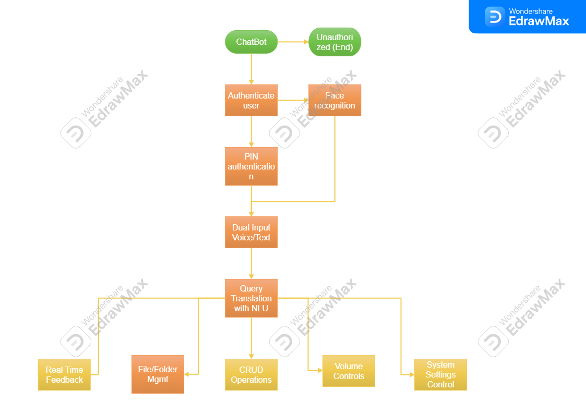
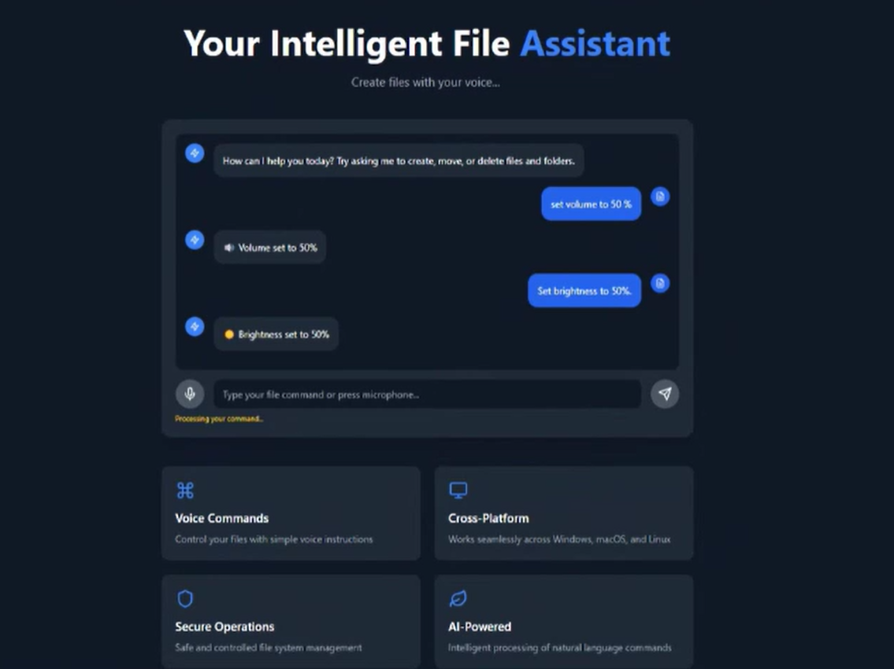
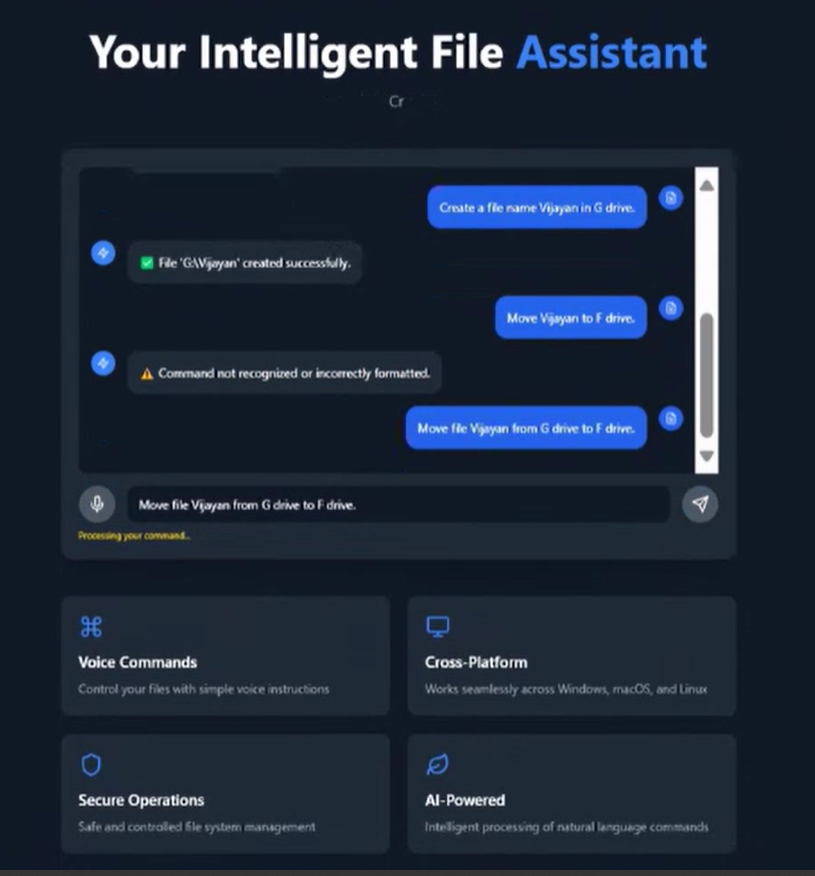

# Ultron-AIAgent: Smart Automation for Your PC

**Ultron-AIAgent** is an AI-powered desktop assistant designed to automate tasks using voice and text commands. It enables seamless app control, file management, and system settings adjustments on **Windows, macOS, and Linux**. With **advanced NLP and automation tools**, Ultron-AIAgent prioritizes **security, productivity, and user-friendliness** while ensuring sustainability.


## Project Demo  
[Watch the Demo Video](https://drive.google.com/file/d/1ctTsM6OXjJ6mG2eGtzZyNNG0wjqubTj-/view?usp=sharing)

## 🔥 Features & Functionalities

### 🔐 Authentication & Security
- Implements authentication mechanisms to restrict access to sensitive files and actions.
- Supports **PIN-based authentication** or **face recognition** for critical operations.
- Ensures unauthorized users cannot perform system-level actions.

### 🎤 Dual Input Modes
- Supports **both voice and text commands** for maximum flexibility.
- Users can choose between **hands-free interaction** or **text-based execution**.

### 🧠 Query Translation with NLU
- Uses **Natural Language Understanding (NLU)** to interpret user commands.
- Translates queries into executable system calls.

**Example:**
- **User Command:** "Create a folder named 'Projects'."
- **Execution:** Automatically creates the folder with the specified name at the designated path.

### 📂 File Management via System Calls
- Uses **system calls** for **faster CRUD (Create, Read, Update, Delete) execution**.
- Enables efficient **file and folder management** (create, delete, move, rename).
- Includes **security features** to restrict access to private or sensitive files.

### ⚙️ System Settings Control
- Controls settings like **volume, brightness, and network** using Python’s `os` and `subprocess` modules.
- Allows users to modify system settings directly through voice or text.

**Example:**
- **Command:** "Set brightness to 80%."
- **Execution:** Adjusts the system brightness accordingly.

### 🤖 Seamless Chatbot Integration
- Both **file management** and **system settings** can be controlled via the chatbot interface.
- Provides **real-time feedback** confirming executed actions.

## 🖼️ Screenshots & Workflow

### 📌 Workflow Diagram


### 📌 Project Screenshots




## 🚀 Installation & Setup

1. **Clone the Repository:**
   ```sh
   git clone https://github.com/koushalpatil/Ultron-AI-Smart-Automation-for-Your-PC.git
   cd Ultron-AI-Smart-Automation-for-Your-PC
   ```
2. **Install Dependencies:**
   ```sh
   pip install -r requirements.txt
   ```
3. **Run the Application:**
   ```sh
   python final.py
   ```

## 🛠️ Technologies Used
- **Python** (NLU, automation, system calls)
- **SpeechRecognition** (voice input processing)
- **NLTK / spaCy** (Natural Language Processing)
- **OpenCV** (Face recognition for authentication)
- **OS & Subprocess** (System control commands)

## 💡 Future Enhancements
- Support for **multiple languages**
- Integration with **smart home devices**
- Cloud-based storage for **cross-device automation**

## 🤝 Contributing
Feel free to contribute! Fork the repository and create a pull request.

## 📄 License
This project is licensed under the **MIT License**.

---
> Developed with ❤️ by TechFusion

